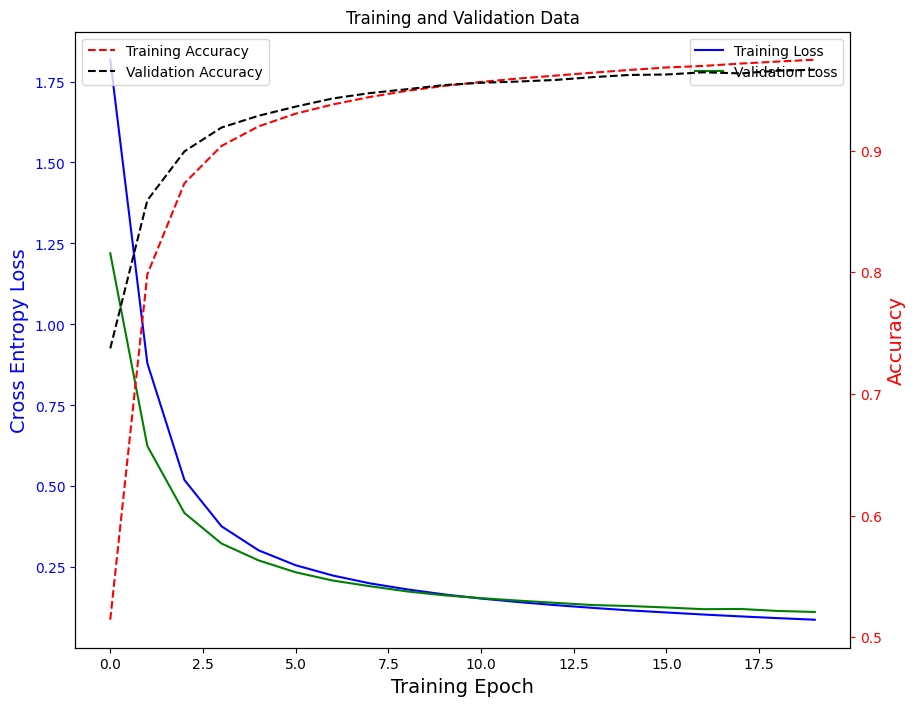

## A Short Timeline

For a long time, the [convolutional neural network (CNN)](http://yann.lecun.com/exdb/publis/pdf/lecun-89e.pdf) was the state-of-the-art architecture for computer vision tasks. But the 2017 seminal paper *[Attention is All You Need](https://proceedings.neurips.cc/paper_files/paper/2017/file/3f5ee243547dee91fbd053c1c4a845aa-Paper.pdf)* introduced the scaled dot-product attention and thus, the transformer was born. Following this in 2021, the paper *[An Image is Worth 16x16 Words: Transformers for Image Recognition at Scale](https://openreview.net/forum?id=YicbFdNTTy)* proposed a way to apply the transformer architecture to computer vision (Vision Transformer - ViT). This has since provided a healthy competition and reduced the reliance on CNNs.

Note that the original transformer architecture was designed for natural language processing (NLP) tasks but it found use in computer vision. This has been a recurring theme where breakthroughs in one field inspire another field. So, it should not be a surprise to know that all of the aforementioned models have been extensively used by physicists in providing variational ansatz to the simulation of correlated systems. I digress.

In the same year, Tolstikhin et al. proved in their paper, *[MLP-Mixer: An all-MLP Architecture for Vision](https://proceedings.nips.cc/paper_files/paper/2021/file/cba0a4ee5ccd02fda0fe3f9a3e7b89fe-Paper.pdf)*, that while convolutions and self-attention are both sufficient for state-of-the-art performance, they are not necessary.

---

## The Mixer

They proposed the exclusive use of multi-layer perceptrons to bypass the two mechanisms in images. This proposed architecture mixes information in two stages — per-location features and spatial mixing. They called it the *MLP-Mixer* or *Mixer* for short. The entire architecture is composed of fully-connected layers, reshapes, transpositions, and scalar non-linearities. So, the most expensive operation is the matrix multiplication routine that you would find in your multi-layer perceptron. The process is:

- Break up the input (image) into patches also called tokens;
- Project the tokens into a higher dimensional representation;
- Your input then takes on the shape "patches × channels" and maintains this dimensionality throughout;
- The mixer contains two mixing layers — one for channel-mixing and another for token-mixing;
- The output from the mixing goes into a classifier head.

The diagram above shows the architecture. We will now look at what it looks like in code. I will be using the machine learning framework, [PyTorch](https://pytorch.org).

---

## The Implementation

```python
import torch
from torch import nn, Tensor

class MixerLayer(nn.Module):
    def __init__(
        self,
        *,
        num_patches: int,
        hidden_dim: int,
        token_mlp_dim: int,
        channel_mlp_dim: int,
        device: str | torch.device = "cpu",
    ) -> None:
        super().__init__()
        self.hidden_dim = hidden_dim
        self.num_patches = num_patches
        self.device = torch.device(device)

        # Layer norms over channels (last dim = hidden_dim)
        self.norm_tokens = nn.LayerNorm(hidden_dim)
        self.norm_channels = nn.LayerNorm(hidden_dim)

        # Token-mixing MLP: acts along S, shared over channels
        self.token_mixer = nn.Sequential(
            nn.Linear(num_patches, token_mlp_dim),
            nn.GELU(),
            nn.Linear(token_mlp_dim, num_patches),
        )

        # Channel-mixing MLP: along the channel dimension, shared over tokens
        self.channel_mixer = nn.Sequential(
            nn.Linear(hidden_dim, channel_mlp_dim),
            nn.GELU(),
            nn.Linear(channel_mlp_dim, hidden_dim),
        )

        self.to(self.device)

    def forward(self, x: Tensor) -> Tensor:
        """
        x: [B, S, C] = [batch, num_patches, hidden_dim]
        """
        # Token mixing
        y = self.norm_tokens(x)              
        y = y.transpose(1, 2)                
        y = self.token_mixer(y)              
        y = y.transpose(1, 2)                
        x = x + y                            

        # Channel mixing
        z = self.norm_channels(x)
        z = self.channel_mixer(z)            
        out = x + z                          

        return out


class Mixer(nn.Module):
    def __init__(
        self,
        *,
        image_size: tuple[int, int],
        patch_size: tuple[int, int],
        hidden_dim: int,
        num_layers: int,
        token_mlp_dim: int,
        channel_mlp_dim: int,
        num_classes: int,
        in_channels: int = 1,
        device: str | torch.device = "cpu",
    ) -> None:
        super().__init__()

        H, W = image_size
        ph, pw = patch_size
        assert H % ph == 0 and W % pw == 0, "Image size must be divisible by patch size."

        self.patch_embed = nn.Conv2d(
            in_channels=in_channels,
            out_channels=hidden_dim,
            kernel_size=patch_size,
            stride=patch_size,
        )

        num_patches = (H // ph) * (W // pw)

        self.mixer = nn.Sequential(
            *[
                MixerLayer(
                    num_patches=num_patches,
                    hidden_dim=hidden_dim,
                    token_mlp_dim=token_mlp_dim,
                    channel_mlp_dim=channel_mlp_dim,
                    device=device
                ) for _ in range(num_layers)
            ]
        )

        self.classifier_head = nn.Linear(hidden_dim, num_classes)
        self.norm = nn.LayerNorm(hidden_dim)

        self.device = torch.device(device)
        self.to(self.device)

    def forward(self, x: Tensor) -> Tensor:
        # x: [B, C, H, W]
        patches_embed = self.patch_embed(x)                 
        patches = patches_embed.flatten(2).transpose(1, 2)  
        y = self.mixer(patches)
        y = self.norm(y)
        y = y.mean(dim=1)
        logits = self.classifier_head(y)

        return logits
```

I will show an example of how to use it with the [MNIST dataset](https://en.wikipedia.org/wiki/MNIST_database). To run the code below, you will need (in addition to **torch**) to install **torchvision** and **tqdm**.

```python
import torch
import torch.nn as nn
from torchvision import datasets, transforms
from torch.utils.data import DataLoader
import torch.optim as optim
from tqdm import tqdm
from typing import NamedTuple


def train_one_epoch(model, loader, optimizer, device):
    model.train()
    total_loss = 0.0
    total_correct = 0
    total_samples = 0

    criterion = nn.CrossEntropyLoss()

    for images, labels in loader:
        images = images.to(device)
        labels = labels.to(device)

        optimizer.zero_grad()
        logits = model(images)
        loss = criterion(logits, labels)
        loss.backward()
        optimizer.step()

        total_loss += loss.item() * images.size(0)
        preds = logits.argmax(dim=1)
        total_correct += (preds == labels).sum().item()
        total_samples += images.size(0)

    avg_loss = total_loss / total_samples
    acc = total_correct / total_samples
    return avg_loss, acc


def eval_epoch(model, loader, device):
    model.eval()
    total_loss = 0.0
    total_correct = 0
    total_samples = 0

    criterion = nn.CrossEntropyLoss()

    with torch.no_grad():
        for images, labels in loader:
            images = images.to(device)
            labels = labels.to(device)

            logits = model(images)
            loss = criterion(logits, labels)

            total_loss += loss.item() * images.size(0)
            preds = logits.argmax(dim=1)
            total_correct += (preds == labels).sum().item()
            total_samples += images.size(0)

    avg_loss = total_loss / total_samples
    acc = total_correct / total_samples
    return avg_loss, acc


class TrainOutput(NamedTuple):
    train_losses: list[float]
    train_acc: list[float]
    test_losses: list[float]
    test_acc: list[float]


def main(*, num_epochs=5, device="cpu", lr=1e-5, weight_decay=1e-8) -> TrainOutput:
    device = torch.device(device)
    print("Device:", device)

    transform = transforms.Compose([
        transforms.ToTensor(),
    ])

    train_dataset = datasets.MNIST(root="./data", train=True, transform=transform, download=True)
    test_dataset = datasets.MNIST(root="./data", train=False, transform=transform, download=True)

    train_loader = DataLoader(train_dataset, batch_size=128, shuffle=True)
    test_loader = DataLoader(test_dataset, batch_size=256, shuffle=False)

    model = Mixer(
        image_size=(28, 28),
        patch_size=(7, 7),
        hidden_dim=128,
        num_layers=4,
        token_mlp_dim=64,
        channel_mlp_dim=256,
        num_classes=10,
        in_channels=1,
    ).to(device)

    optimizer = optim.Adam(model.parameters(), lr=lr, weight_decay=weight_decay)

    train_losses, train_accs = [], []
    test_losses, test_accs = [], []

    with tqdm(range(num_epochs), desc="Training") as pbar:
        for epoch in pbar:
            train_loss, train_acc = train_one_epoch(model, train_loader, optimizer, device)
            test_loss, test_acc = eval_epoch(model, test_loader, device)

            train_losses.append(train_loss)
            train_accs.append(train_acc)
            test_losses.append(test_loss)
            test_accs.append(test_acc)

            pbar.set_postfix({
                "Epoch": epoch + 1,
                "train_loss": train_loss,
                "train_acc": train_acc,
                "test_loss": test_loss,
                "test_acc": test_acc,
            })

    return TrainOutput(train_losses, train_accs, test_losses, test_accs)


out = main(device="mps", num_epochs=20, weight_decay=1e-5, lr=1e-5)

import matplotlib.pyplot as plt

plt.plot(out.train_losses, label="Training Loss")
plt.plot(out.test_losses, label="Test Loss")
plt.title("Training vs Validation Loss")
plt.xlabel("Training Epoch")
plt.ylabel("Cross Entropy Loss")
plt.legend()
plt.show()
```



In the next episode, I would be discussing how we can potentially flip this model to study a quantum system.
