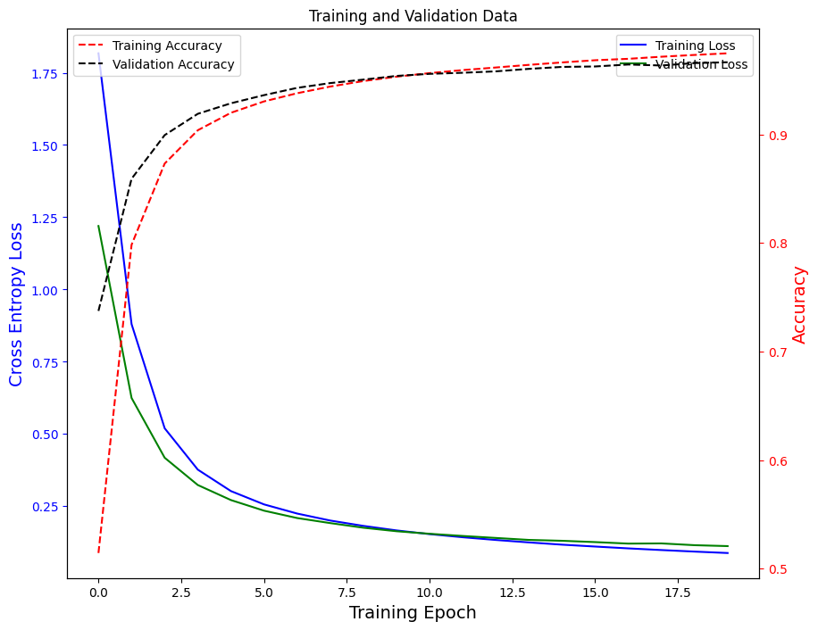

## A Short Timeline

For many years, the [convolutional neural network (CNN)](http://yann.lecun.com/exdb/publis/pdf/lecun-89e.pdf) dominated computer-vision tasks. The 2017 paper *[Attention Is All You Need](https://proceedings.neurips.cc/paper_files/paper/2017/file/3f5ee243547dee91fbd053c1c4a845aa-Paper.pdf)* introduced the Transformer and its scaled dot-product attention mechanism. In 2021, *[An Image Is Worth 16x16 Words: Transformers for Image Recognition at Scale](https://openreview.net/forum?id=YicbFdNTTy)* showed how to apply a Transformer architecture to computer vision through the Vision Transformer (ViT). This development created a strong alternative to CNN-based vision systems.

The original Transformer was designed for natural-language processing, but it soon found applications in computer vision. This is a recurring pattern: breakthroughs in one field inspire progress in another. Physicists have similarly adapted these architectures as variational ansätze for correlated quantum systems.

In the same year, Tolstikhin et al. showed in *[MLP-Mixer: An All-MLP Architecture for Vision](https://proceedings.nips.cc/paper_files/paper/2021/file/cba0a4ee5ccd02fda0fe3f9a3e7b89fe-Paper.pdf)* that competitive vision performance did not strictly require either convolutions or self-attention.

---

## The Mixer

The authors proposed using multilayer perceptrons in place of both mechanisms. The architecture mixes information in two stages: across spatial locations and across feature channels. They called it the *MLP-Mixer*, or *Mixer* for short. It consists primarily of fully connected layers, reshaping, transposition, and element-wise nonlinearities. Its dominant operation is the matrix multiplication used by a multilayer perceptron. The process is:

- Divide the input image into patches, also called tokens.
- Project the tokens into a higher-dimensional representation.
- Arrange the representation as patches × channels and preserve those dimensions throughout the Mixer blocks.
- Apply one MLP across tokens and another across channels.
- Send the mixed representation to a classification head.

We can now examine the architecture in [PyTorch](https://pytorch.org).

---

## The Implementation

```python
import torch
from torch import nn, Tensor

class MixerLayer(nn.Module):
    def __init__(
        self,
        *,
        num_patches: int,
        hidden_dim: int,
        token_mlp_dim: int,
        channel_mlp_dim: int,
        device: str | torch.device = "cpu",
    ) -> None:
        super().__init__()
        self.hidden_dim = hidden_dim
        self.num_patches = num_patches
        self.device = torch.device(device)

        # Layer norms over channels (last dim = hidden_dim)
        self.norm_tokens = nn.LayerNorm(hidden_dim)
        self.norm_channels = nn.LayerNorm(hidden_dim)

        # Token-mixing MLP: acts along S, shared over channels
        self.token_mixer = nn.Sequential(
            nn.Linear(num_patches, token_mlp_dim),
            nn.GELU(),
            nn.Linear(token_mlp_dim, num_patches),
        )

        # Channel-mixing MLP: along the channel dimension, shared over tokens
        self.channel_mixer = nn.Sequential(
            nn.Linear(hidden_dim, channel_mlp_dim),
            nn.GELU(),
            nn.Linear(channel_mlp_dim, hidden_dim),
        )

        self.to(self.device)

    def forward(self, x: Tensor) -> Tensor:
        """
        x: [B, S, C] = [batch, num_patches, hidden_dim]
        """
        # Token mixing
        y = self.norm_tokens(x)              
        y = y.transpose(1, 2)                
        y = self.token_mixer(y)              
        y = y.transpose(1, 2)                
        x = x + y                            

        # Channel mixing
        z = self.norm_channels(x)
        z = self.channel_mixer(z)            
        out = x + z                          

        return out


class Mixer(nn.Module):
    def __init__(
        self,
        *,
        image_size: tuple[int, int],
        patch_size: tuple[int, int],
        hidden_dim: int,
        num_layers: int,
        token_mlp_dim: int,
        channel_mlp_dim: int,
        num_classes: int,
        in_channels: int = 1,
        device: str | torch.device = "cpu",
    ) -> None:
        super().__init__()

        H, W = image_size
        ph, pw = patch_size
        assert H % ph == 0 and W % pw == 0, "Image size must be divisible by patch size."

        self.patch_embed = nn.Conv2d(
            in_channels=in_channels,
            out_channels=hidden_dim,
            kernel_size=patch_size,
            stride=patch_size,
        )

        num_patches = (H // ph) * (W // pw)

        self.mixer = nn.Sequential(
            *[
                MixerLayer(
                    num_patches=num_patches,
                    hidden_dim=hidden_dim,
                    token_mlp_dim=token_mlp_dim,
                    channel_mlp_dim=channel_mlp_dim,
                    device=device
                ) for _ in range(num_layers)
            ]
        )

        self.classifier_head = nn.Linear(hidden_dim, num_classes)
        self.norm = nn.LayerNorm(hidden_dim)

        self.device = torch.device(device)
        self.to(self.device)

    def forward(self, x: Tensor) -> Tensor:
        # x: [B, C, H, W]
        patches_embed = self.patch_embed(x)                 
        patches = patches_embed.flatten(2).transpose(1, 2)  
        y = self.mixer(patches)
        y = self.norm(y)
        y = y.mean(dim=1)
        logits = self.classifier_head(y)

        return logits
```

The following example trains the model on the [MNIST dataset](https://en.wikipedia.org/wiki/MNIST_database). In addition to **torch**, it requires **torchvision** and **tqdm**.

```python
import torch
import torch.nn as nn
from torchvision import datasets, transforms
from torch.utils.data import DataLoader
import torch.optim as optim
from tqdm import tqdm
from typing import NamedTuple


def train_one_epoch(model, loader, optimizer, device):
    model.train()
    total_loss = 0.0
    total_correct = 0
    total_samples = 0

    criterion = nn.CrossEntropyLoss()

    for images, labels in loader:
        images = images.to(device)
        labels = labels.to(device)

        optimizer.zero_grad()
        logits = model(images)
        loss = criterion(logits, labels)
        loss.backward()
        optimizer.step()

        total_loss += loss.item() * images.size(0)
        preds = logits.argmax(dim=1)
        total_correct += (preds == labels).sum().item()
        total_samples += images.size(0)

    avg_loss = total_loss / total_samples
    acc = total_correct / total_samples
    return avg_loss, acc


def eval_epoch(model, loader, device):
    model.eval()
    total_loss = 0.0
    total_correct = 0
    total_samples = 0

    criterion = nn.CrossEntropyLoss()

    with torch.no_grad():
        for images, labels in loader:
            images = images.to(device)
            labels = labels.to(device)

            logits = model(images)
            loss = criterion(logits, labels)

            total_loss += loss.item() * images.size(0)
            preds = logits.argmax(dim=1)
            total_correct += (preds == labels).sum().item()
            total_samples += images.size(0)

    avg_loss = total_loss / total_samples
    acc = total_correct / total_samples
    return avg_loss, acc


class TrainOutput(NamedTuple):
    train_losses: list[float]
    train_acc: list[float]
    test_losses: list[float]
    test_acc: list[float]


def main(*, num_epochs=5, device="cpu", lr=1e-5, weight_decay=1e-8) -> TrainOutput:
    device = torch.device(device)
    print("Device:", device)

    transform = transforms.Compose([
        transforms.ToTensor(),
    ])

    train_dataset = datasets.MNIST(root="./data", train=True, transform=transform, download=True)
    test_dataset = datasets.MNIST(root="./data", train=False, transform=transform, download=True)

    train_loader = DataLoader(train_dataset, batch_size=128, shuffle=True)
    test_loader = DataLoader(test_dataset, batch_size=256, shuffle=False)

    model = Mixer(
        image_size=(28, 28),
        patch_size=(7, 7),
        hidden_dim=128,
        num_layers=4,
        token_mlp_dim=64,
        channel_mlp_dim=256,
        num_classes=10,
        in_channels=1,
    ).to(device)

    optimizer = optim.Adam(model.parameters(), lr=lr, weight_decay=weight_decay)

    train_losses, train_accs = [], []
    test_losses, test_accs = [], []

    with tqdm(range(num_epochs), desc="Training") as pbar:
        for epoch in pbar:
            train_loss, train_acc = train_one_epoch(model, train_loader, optimizer, device)
            test_loss, test_acc = eval_epoch(model, test_loader, device)

            train_losses.append(train_loss)
            train_accs.append(train_acc)
            test_losses.append(test_loss)
            test_accs.append(test_acc)

            pbar.set_postfix({
                "Epoch": epoch + 1,
                "train_loss": train_loss,
                "train_acc": train_acc,
                "test_loss": test_loss,
                "test_acc": test_acc,
            })

    return TrainOutput(train_losses, train_accs, test_losses, test_accs)


out = main(device="mps", num_epochs=20, weight_decay=1e-5, lr=1e-5)

import matplotlib.pyplot as plt

plt.plot(out.train_losses, label="Training Loss")
plt.plot(out.test_losses, label="Test Loss")
plt.title("Training vs Validation Loss")
plt.xlabel("Training Epoch")
plt.ylabel("Cross Entropy Loss")
plt.legend()
plt.show()
```



The next article will examine how this architecture can be adapted to represent a quantum system.
