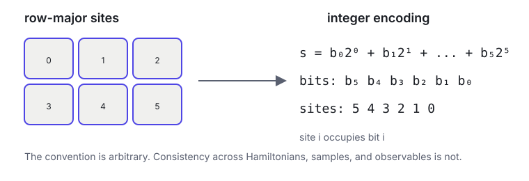



Exact diagonalization is often introduced as the method that stops working when the system becomes large. That is true, but incomplete. Before it stops, it gives us something extraordinarily valuable: an oracle against which every convention, estimator, and learned state can be tested.

I do not use exact diagonalization only to obtain a reference energy. I use it to ask whether I built the intended problem.

## From spin strings to matrix indices

For \\(N\\) spin-\\(\tfrac12\\) sites, encode a configuration as

$$
s=\sum_{i=0}^{N-1}b_i2^i, \qquad b_i\in\{0,1\}.
$$

This is a little-endian convention: site \\(i\\) occupies bit \\(i\\). Lattice coordinates are mapped to sites in row-major order.

The Hilbert-space dimension is

$$
D=2^N.
$$

For \\(N=16\\), \\(D=65{,}536\\), which is manageable with sparse methods. For \\(N=36\\), \\(D\\) exceeds 68 billion. Exponential growth arrives quickly.

## Constructing the Hamiltonian

The most transparent construction iterates over basis states and Hamiltonian terms.

For TFIM,

$$
H=-J\sum_{\langle ij\rangle}Z_iZ_j-h\sum_iX_i,
$$

the diagonal contribution for state \\(s\\) is computed from its bits. Each \\(X_i\\) term connects \\(s\\) to

$$
s'=s\oplus2^i,
$$

where \\(\oplus\\) is bitwise exclusive OR.

For a Heisenberg bond,

$$
J_{ij}\mathbf S_i\cdot\mathbf S_j = \frac{J_{ij}}4 (X_iX_j+Y_iY_j+Z_iZ_j),
$$

the \\(Z_iZ_j\\) term is diagonal while \\(X_iX_j+Y_iY_j\\) exchanges anti-aligned spins. This structure preserves total \\(S^z\\), allowing us to work in a fixed-magnetization sector.

Every factor and pair count should be tested on a two-site system before trusting a \\(6\times6\\) reference.

## Symmetry sectors buy room

If the Hamiltonian conserves the number of up spins, we need not include every bit string. At zero magnetization for even \\(N\\),

$$
D_{S^z=0}=\binom{N}{N/2}.
$$

For \\(N=16\\), this gives 12,870 states instead of 65,536. Translation, reflection, spin inversion, and point-group symmetries can reduce the space further, though each additional symmetry increases implementation complexity.

A sector restriction is valid only if the Hamiltonian preserves that sector. Applying fixed magnetization to TFIM would be physically wrong because the transverse field flips one spin.

## Dense versus sparse

A dense complex \\(D\times D\\) matrix requires approximately

$$
16D^2\ \text{bytes}
$$

in double precision. At \\(D=4096\\), that is about 256 MiB. At \\(D=65{,}536\\), it is about 64 GiB.

Local spin Hamiltonians are sparse, so iterative eigensolvers can apply \\(H\\) without storing every matrix entry. Lanczos or related methods can find a few extremal eigenpairs. Dense construction remains useful for very small parity tests because it makes element-by-element comparisons simple.

## What I validate with the oracle

For small lattices, exact calculations allow me to test:

1. **Matrix parity:** two implementations produce the same Hamiltonian.
2. **Hermiticity:** \\(H=H^\dagger\\).
3. **Reference energy:** the variational estimate respects \\(E_\theta\ge E_0\\) within statistical and numerical tolerance.
4. **Local energy:** direct matrix multiplication agrees with connected-state evaluation.
5. **Sampling:** exact probabilities match empirical autoregressive frequencies.
6. **Fidelity:** \\(|\langle\psi_0|\psi_\theta\rangle|^2\\).
7. **Sign agreement:** errors are weighted by exact ground-state probability.
8. **Dynamics:** small-system TDVP trajectories can be compared with \\(e^{-iHt}|\psi(0)\rangle\\).

An energy match alone can miss a basis permutation or observable-normalization error that happens to preserve the spectrum.

## Two backends are better than one when they disagree usefully

My current workflow keeps a native sparse builder and an optional qslib dense builder for small-system parity. The purpose of the second implementation is not speed. It is independent construction.

The comparison contract fixes:

- row-major sites;
- little-endian basis bits;
- signed coupling per unique pair;
- TFIM convention \\(-JZZ-hX\\);
- Heisenberg convention \\(J(XX+YY+ZZ)/4\\);
- Rydberg occupation and detuning convention.

If the matrices disagree, I want the test to fail loudly before an optimizer spends hours learning the mismatch.

## Exact does not mean error-free

The eigensolver may have a residual. Degenerate eigenvectors can differ by arbitrary rotations within a subspace. Floating-point precision matters. A dense memory limit can be exceeded long before the formal site limit.

“Exact” here means no variational approximation within the selected finite basis and numerical tolerance. The finite lattice, boundary condition, sector, and floating-point solve remain part of the statement.

## The role I give it

Exact diagonalization is a microscope. It cannot image the largest object, but it can reveal whether the instruments are aligned.

Before trusting a scaling curve, I want at least one small lattice where the full matrix, state vector, local energy, sampler, observables, and dynamics can all be cross-examined. Exponential scaling limits the oracle’s jurisdiction. It does not reduce its authority where it applies.

## Further reading

- [Lanczos, *An iteration method for the solution of the eigenvalue problem*](https://doi.org/10.6028/jres.045.026)
- [Sandvik, *Computational Studies of Quantum Spin Systems*](https://arxiv.org/abs/1101.3281)
- [SciPy sparse eigensolver documentation](https://docs.scipy.org/doc/scipy/reference/generated/scipy.sparse.linalg.eigsh.html)
