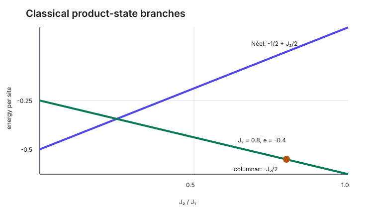



The first time I saw the energy stop improving, I assumed the optimizer had become slow. Then several different methods stopped at almost the same value. Some models landed exactly on a classical energy. The plateau was no longer an inconvenience. It was evidence.

This is the story of how a neural quantum state can reduce a quantum problem to a small collection of classical configurations and still look numerically calm.

## The setting

The square-lattice \\(J_1-J_2\\) Hamiltonian is

$$
H= J_1\sum_{\langle ij\rangle}\mathbf S_i\cdot\mathbf S_j + J_2\sum_{\langle\langle ij\rangle\rangle} \mathbf S_i\cdot\mathbf S_j.
$$

For classical product states in the \\(S^z\\) basis, the Néel and columnar branches have simple per-site energies under my \\(J_1=1\\), \\(\mathbf S=\boldsymbol\sigma/2\\) convention:

$$
e_{\mathrm{N\acute eel}}=-\frac12+\frac{J_2}{2}, \qquad e_{\mathrm{col}}=-\frac{J_2}{2}.
$$

Quantum fluctuations should lower the ground-state energy below the best product-state value. When a variational state terminates exactly on one of these branches, it is telling us something about its support.

## The freeze at \\(J_2=0.8\\)

On the \\(6\times6\\) system, several recipes stalled near

$$
e\approx-0.458.
$$

The reference energy density used in the study is approximately \\(-0.5865\\), based on the finite-size results of [Choo, Neupert, and Carleo](https://doi.org/10.1103/PhysRevB.100.125124). The plateau is therefore roughly 22% high.

The striking part was repetition. Baseline optimization, a learnable gauge, minimum-SR variants, and other architectural levers converged near the same region. A high-rank solve and a short annealing attempt improved the value only to about \\(-0.475\\), still roughly 19% high.

Then the convolutional family provided the clearest clue: several variants finished at

$$
e=-0.4000,
$$

which is exactly the classical columnar value \\(-J_2/2\\) at \\(J_2=0.8\\).

The network had not merely failed to reach the quantum ground state. It had learned a classical attractor.

## How amplitude collapse creates the trap

An autoregressive wavefunction defines a probability distribution \\(p_\theta(\sigma)\\). During training, it may concentrate probability on a few configurations that immediately lower the sampled objective.

As the support narrows:

1. alternative configurations are sampled less often;
2. their energy and sign information contributes less to the gradient;
3. the model becomes increasingly confident in the surviving patterns;
4. local-energy variance can fall because the surviving support is internally consistent.

This is related to mode collapse in generative modelling, but the quantum setting adds interference. Suppressing a configuration can be an easier way to avoid a bad sign than learning the correct sign relation.

Once probability has disappeared from the configurations needed to escape, the optimizer may see no useful path out.

## Why more capacity did not automatically help

The collapsed convolutional models ranged across substantially different parameter counts, yet they shared the same classical endpoint. This argues against a simple lack-of-capacity explanation.

Likewise, changing the linear solver did not reliably move the state away from the basin. Better geometric optimization cannot recover information that the sampler no longer visits in sufficient quantity.

This does not mean capacity and solvers are irrelevant. It means the observed plateau had a more specific mechanism than “the model was too small” or “Adam was inadequate.”

## What the trajectory reveals

A final energy is only the last page. The trajectory contains the plot.

Useful quantities include:

- energy density;
- local-energy variance;
- probability entropy;
- number of distinct configurations;
- maximum configuration probability;
- Néel and columnar structure factors;
- sign fidelity on an exactly solvable lattice;
- gradient and update norms.

In a classical lock, the energy and variance may look beautifully converged while entropy and support collapse. The structure factor identifies which classical order captured the state.

This is why I now hesitate when a run looks *too* smooth.

## The resolution in the current experiments

Two interventions broke the wall:

- a suitable columnar sign gauge;
- entropy annealing followed by ordinary energy optimization.

The columnar gauge reached about 1.5% error after 2,000 epochs in the cited \\(6\times6\\) study. The longer annealed grid brought several architectures into approximately the 0.5-1% range at \\(J_2=0.8\\).

These are internal experimental results, not a universal theorem. The campaign spans specific architectures, budgets, schedules, and seeds. Yet the exact classical endpoints and repeated plateaus make the collapse interpretation considerably stronger than a story told from one unfortunate run.

## What I learned from the failure

Optimization failure can contain physical structure. The location of the plateau identifies a classical state. Its persistence across recipes identifies an attractor. The response to a sign gauge identifies an interference problem. The response to entropy identifies a support problem.

The result is more useful than “training did not converge.” It tells us which part of the wavefunction stopped being quantum and suggests what must be protected during optimization.

The next question is how entropy annealing provides that protection, and what it does *not* solve.

## Further reading

- [Westerhout et al., *Generalization properties of neural network approximations to frustrated magnet ground states*](https://doi.org/10.1038/s41467-020-15402-w)
- [Szabó and Castelnovo, *Neural network wave functions and the sign problem*](https://doi.org/10.1103/PhysRevResearch.2.033075)
- [Choo, Neupert, and Carleo, *Two-dimensional frustrated J1-J2 model studied with neural network quantum states*](https://doi.org/10.1103/PhysRevB.100.125124)
