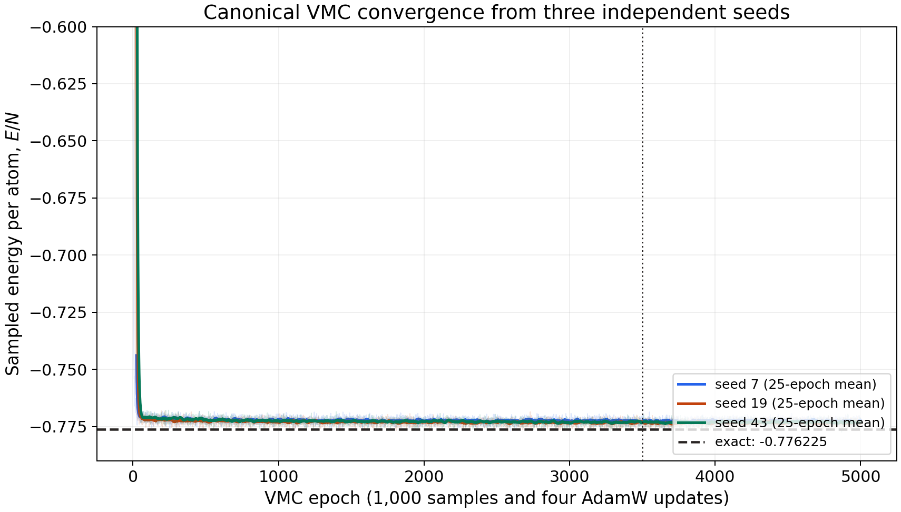
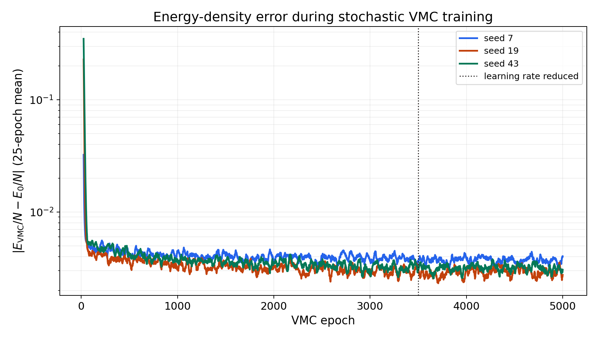



In [Part Two](/posts/21-mixer-neural-quantum-state/), we discussed how the MLP-Mixer can be an autoregressive neural quantum state. A natural next question is whether the construction can represent the ground state of an interacting quantum system.

This article answers only that small question. It is a proof of concept, not a benchmark and not a preview of the full unpublished study.

## Rydberg chain with open boundary conditions

Consider a chain of [Rydberg atoms](https://en.wikipedia.org/wiki/Rydberg_atom):

```text
1 -- 2 -- 3 -- 4 -- 5 -- 6 -- 7 -- 8
```

The ends are not connected. The chain therefore has open boundary conditions rather than periodic, where it would have wrapped into a ring.

Each atom has a ground state \\(|0\rangle\\) and a Rydberg state \\(|1\rangle\\). I use the Hamiltonian

$$ H=-\frac{\Omega}{2}\sum_{i=1}^{N}\sigma_i^x-\delta\sum_{i=1}^{N}n_i+\sum_{i<j}V_{ij}n_i n_j. $$

where

$$ n_i=\mid 1\rangle_i\langle 1 \mid_i , \qquad V_{ij}=\Omega\left(\frac{R_b}{r_{ij}}\right)^6. $$

\\(n_i\\) is the projector (occupation number) of the Rydberg state; \\(\sigma_i^x\\) represents the laser driving transition between the ground and Rydberg state with \\(\Omega\\) Rabi frequency and \\(\delta\\) detuning; \\(R_b\\) is the Rydberg blockade radius. The Rabi term flips an atom between its two states. Positive detuning favours Rydberg occupation, while the van der Waals interaction penalizes nearby simultaneous excitations.

For this demonstration,

$$ N=8,\qquad \Omega=1,\qquad \delta=1.2,\qquad R_b=3^{1/6}. $$

with unit lattice spacing and interactions retained at every separation within the finite chain. All energies are reported in units of \\(\Omega\\).

The choice \\(R_b=3^{1/6}\\) makes the nearest-neighbour interaction \\(V_{i,i+1}=3\\). Because the interaction decays as \\(r^{-6}\\), more distant pairs contribute much less, but they are not discarded.

## Why use such a small system?

Eight binary sites have a Hilbert-space dimension of

$$ 2^8=256. $$

That is small enough to construct the full Hamiltonian matrix and diagonalize it exactly. The result gives a reference ground-state energy and wavefunction against which the neural state can be tested.

This is not the regime in which a neural quantum state is computationally necessary. It is the regime in which its conventions are easiest to audit. Exact diagonalization catches sign errors, double-counted interactions, incorrect basis ordering, and mismatches between the model’s probability and its sampler before those mistakes become expensive.

## The deliberately compact Mixer

I represent the chain site by site, in left-to-right order. At each step, the Mixer predicts the conditional probability of the next atom being in \\(|0\rangle\\) or \\(|1\rangle\\):

$$ p_\theta(\sigma)=\prod_{i=1}^{8}p_\theta(\sigma_i\mid\sigma_{<i}). $$

The demonstration uses two causal Mixer layers, a hidden dimension of 32, and 11,460 trainable parameters. The token-mixing expansion factor is 1 and the channel-mixing expansion factor is 2. Learned token and site-position embeddings are both active. I omit the phase head because this Hamiltonian is stoquastic in the chosen basis and its ground-state amplitudes can be taken to be real and positive.

## Conventional variational Monte Carlo

The model is trained with the usual sampled VMC procedure, not with an exact sum over the 256 basis states. At each epoch I:

1. draw 1,000 configurations directly from the autoregressive distribution \\(p_\theta(\sigma)=|\psi_\theta(\sigma)|^2\\);
2. evaluate the local energy

   $$E_{\mathrm{loc}}(\sigma)=\sum_{\sigma'}H_{\sigma\sigma'}\frac{\psi_\theta(\sigma')}{\psi_\theta(\sigma)};$$

3. form the stochastic energy-gradient estimator from the centred local energies and \\(\nabla_\theta\log\psi_\theta(\sigma)\\); and
4. divide the samples into four mini-batches of 250 and make four optimizer updates.

Direct autoregressive sampling produces independent configurations conditional on the current model, so it does not require a Markov-chain burn-in. The model changes during training, however, which means the five million configurations generated over 5,000 epochs are not one sample from the final state.

Exact enumeration is used only after training as a small-system validation tool. It is not the training objective.

### Reproducibility record

| Component | Choice |
|:--|:--|
| Random seeds | 7, 19, and 43 |
| Model mode | site-autoregressive, left-to-right |
| Mixer depth | 2 causal Mixer layers |
| Hidden dimension | 32 |
| Token/channel expansion | 1 / 2 |
| Phase head | disabled |
| Parameter count | 11,460 |
| Samples per epoch | 1,000 direct autoregressive samples |
| Mini-batch size | 250 |
| Training length | 5,000 epochs and 20,000 optimizer updates per seed |
| Optimizer | AdamW, \\(\beta_1=0.9\\), \\(\beta_2=0.999\\), \\(\epsilon=10^{-8}\\) |
| Learning rate | \\(10^{-3}\\), reduced to \\(2\times10^{-4}\\) at epoch 3,500 |
| Weight decay | 0 |
| Gradient clipping | global norm limited to 1.0 |
| Energy clipping | disabled |
| Arithmetic | PyTorch `float32`/`complex64`; exact reference in NumPy `float64` |
| Execution | CPU, one PyTorch thread |
| Software | Python 3.13.7, PyTorch 2.8.0, NumPy 2.3.2 |
| Platform | macOS 26.5.1, Apple Silicon (`arm64`) |


## Training trajectory

The pale lines below are the sampled energy estimates from every epoch. The darker lines are trailing 25-epoch means, included to make the stochastic trend visible.



Individual finite-sample estimates can fall below the exact ground-state energy. This does not violate the variational principle: the principle applies to the exact expectation value of the model state, whereas each plotted epoch is a noisy estimate based on 1,000 samples.

The absolute-error view shows the initial descent and the stochastic plateau more clearly:



The sampled energy variance per atom is also recorded at every epoch in the downloadable data. Because it is computed from the same finite batch of local energies, it remains a noisy diagnostic rather than an exact eigenstate test.

### Data and analysis

- **[Download every sampled VMC epoch](vmc-training-data.txt)**
- **[Download the three-seed summary](vmc-seed-summary.txt)**
- **[Download the Python training and plotting script](vmc_convergence.py)**

The epoch file contains the sampled energy density, its standard error, and sampled variance density for every epoch and every seed. The separate summary records the trailing-window results and post-training exact checks. The script imports the public model and canonical VMC training routine from the research repository through `NQS_CLI_ROOT`; it does not expose the larger unpublished study.

## Minimal result

The final 100-epoch statistics are:

| Seed | Mean \\(E/N\\) | Epoch-to-epoch SD | Raw final epoch |
|--:|--:|--:|--:|
| 7 | -0.772572 | 0.001190 | -0.771767 |
| 19 | -0.773271 | 0.001085 | -0.772777 |
| 43 | -0.773112 | 0.001120 | -0.772606 |

Across the three seed means, the VMC estimate is

$$ \frac{E_{\mathrm{VMC}}}{N}=-0.772985\pm0.000211, $$

where the quoted uncertainty is the standard error across three independently initialized runs. With only three seeds, it should be read as a compact measure of run-to-run spread, not a formal confidence interval.

| Method | Energy per atom |
|:--|--:|
| Exact diagonalization | -0.776225 |
| Mixer NQS, sampled VMC trailing mean | \\(-0.772985\pm0.000211\\) |
| Mixer NQS, post-training exact evaluation | -0.772976 |
| Browser SSE, \\(\beta=16\\) | \\(-0.772036\pm0.0031\\) |

For the post-training check, I enumerate all 256 configurations only after optimization. Averaged over the three trained states, the exact variational energy density is \\(-0.772976\\), the energy variance per atom is \\(0.009545\\), the squared ground-state overlap is \\(0.981793\\), and the mean Rydberg occupation is \\(0.438657\\). The exact variational energies remain above the exact ground-state value for every seed.

The close agreement between the sampled trailing mean and the post-training exact evaluation is a useful consistency check, while the overlap shows that the compact Mixer has learned a credible—but not converged—ground-state approximation.

That is the entire empirical claim of this article.

## A second route: SSE in the browser

The SSE number is useful for more than filling another table row. It reaches the same physical quantity by a very different route: finite-temperature quantum Monte Carlo rather than a variational wavefunction or matrix diagonalization.

For the comparison, the browser is configured for the same eight-site open chain with

$$ \Omega=1,\qquad \delta=1.2,\qquad C_6=3. $$

so that \\(V_{ij}=C_6/r_{ij}^6\\) matches the interaction convention above. The automatic inverse-temperature ladder ends at \\(\beta=2L=16\\). The quoted result,

$$ \frac{E_{\mathrm{SSE}}}{N}=-0.772036\pm0.0031. $$

is the demo's ground-state estimate at that final inverse temperature. The exact value lies about 1.35 reported standard errors below the SSE mean. That is reasonable agreement for this short browser calculation, but it should not be read as proof that all finite-temperature or autocorrelation effects have disappeared.

This cross-check is also a practical demonstration of the software itself. The simulation runs locally in a WebAssembly worker, reports an autocorrelation-aware uncertainty, and can export the same configuration for the native SSE command-line program. Nothing about the calculation is replaced by a precomputed chart.

Try the [interactive SSE demo](https://lere01.github.io/sse/demo/) by selecting **Rydberg**, setting an **8 × 1 open chain**, and entering the parameters above.

## What this result does and does not show

It shows that a small causal Mixer can represent a useful approximation to the ground state of this finite interacting chain. It also shows that the amplitude, Hamiltonian convention, and exact reference can be made mutually consistent.

It does not establish that the Mixer is better than an RNN, Transformer, or another neural quantum state. It does not test scaling, parameter efficiency, sampling throughput, or performance across a phase diagram. Three seeds reveal some optimization variability, but they are not enough for a broad robustness or uncertainty study. A single small chain and a single parameter point cannot support those conclusions.

The exact overlap is also a luxury of this example. For a system large enough to motivate neural quantum states, the exact ground-state vector is unavailable, and validation must rely on a wider collection of diagnostics.

## Why I still find the exercise useful

The result is modest, but it closes the conceptual loop:

1. the image Mixer in Part One provides token and channel mixing;
2. causality and conditional outputs in Part Two turn it into a normalized wavefunction;
3. the eight-atom chain gives that wavefunction a physical job and an exact test.

There is a broader lesson here. Small-system calculations are not miniature claims about large-system performance. They are controlled experiments on the correctness of the method. Before asking an architecture to discover many-body physics at scale, I want evidence that it can reproduce the answer when the answer is known.


## Series

- [Part One: the MLP-Mixer for image classification](/posts/05-mixer_architecture/)
- [Part Two: making the Mixer a neural quantum state](/posts/21-mixer-neural-quantum-state/)

## Further reading

- [Browaeys and Lahaye, *Many-body physics with individually controlled Rydberg atoms*](https://doi.org/10.1038/s41567-020-1113-z)
- [Carleo et al., *Machine learning and the physical sciences*](https://doi.org/10.1103/RevModPhys.91.045002)
- [Sharir et al., *Deep Autoregressive Models for the Efficient Variational Simulation of Many-Body Quantum Systems*](https://arxiv.org/abs/1902.04057)
